<h1 align="center">Hi, I'm Mohammed Alkindi</h1>

<p align="center">
  <em>ProofX founder | CS @ UC San Diego | Data Analytics @ Shell</em>
</p>

<p align="center">
  I build research tools, data systems, and small experiments around math, ML, and reproducibility.
</p>

<p align="center">
  <a href="https://www.alkindix.com">AlkindiX.com</a> |
  <a href="https://www.linkedin.com/in/alkindi-network">LinkedIn</a> |
  <a href="mailto:alkindi.ceo@gmail.com">Email</a>
</p>

## Working On

```txt
ProofX    computational experiments for integer dynamics
Germinal  Lean 4 formalization + proof/counterexample search
Folio     local document search with cited answers
Shell     reporting pipelines and operational analytics
```

## Stats

<p align="center">
  
</p>

## Activity

<p align="center">
  
</p>

## Metrics

<p align="center">
  
</p>

<p align="center">
  
</p>

---

<p align="center"><em>"Build systems that make reasoning inspectable."</em></p>

<p align="center">
  <sub><em>Auto-update daily | powered by <a href="https://github.com/lowlighter/metrics">lowlighter/metrics</a></em></sub>
</p>
